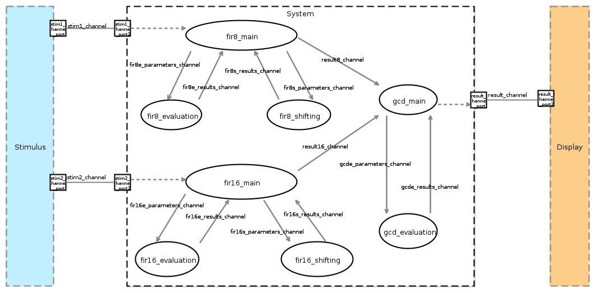
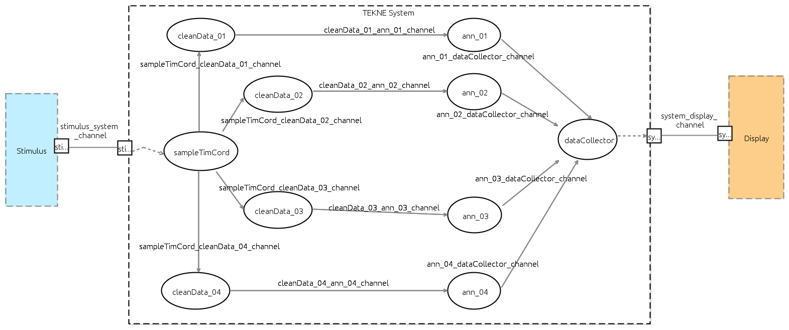

# HEPSYCODE-AIDOaRt
HEPSYCODE Modeling Methodology, Framework and tools for AIDOaRt European Project

[](https://www.gnu.org/licenses/gpl-3.0)

### OVERVIEW
The HEPSYCODE-Workbench directory contains two subdirectories:

 1. FIRFIRGCD: This is an an example Hepsycode project, called FirFirGCD, a synthetic application that takes in input two values (triggered by some stimulus), makes two filtering actions (Fir8 and Fir16), and then makes the greatest common divisor (GCD) and displays the result.
More details can be found at the link: www.hepsycode.com.



 2. TEK_UCS_01: This is the TEKNE AIDOaRt UC application that uses the HEPSYCODE framework to implement a diagnostic and prognostic system for industrial electric/electronic motors. TEKNE develops the demonstrator of a Prognostics and Health Management (PHM) system, for anomalies detection and classification and for condition-based maintenance of the on-board power electronics. The demonstrator considers the inverter and is experimented in an electric minivan prototype. 



### RELEASE NOTES
Latest Release: 2.0.0
 
### LICENSE
GNU GENERAL PUBLIC LICENSE Version 3, 29 June 2007 (see https://www.gnu.org/licenses/gpl-3.0.en.html)
 
### SUPPORT
We currently support:

 1. Email: 
    - Luigi Pomante, luigi.pomante@univaq.it
    - Vittoriano Muttillo, vittoriano.muttillo@graduate.univaq.it
    - Marco Santic, marco.santic@guest.univaq.it
    - (please take care to use \[HEPSYCODE SUPPORT\] as object
 2. Issues on bitbucket.org

## Additional information
Research publications are available on http://www.hepsycode.com/ and http://www.pomante.net/sito_gg/Publications.htm

If you use HEPSYCODE in your research, please cite:
```
@ARTICLE{MUTTILLO2023108803,
  title = {SystemC-based Co-Simulation/Analysis for System-Level Hardware/Software Co-Design},
  journal = {Computers and Electrical Engineering},
  volume = {110},
  pages = {108803},
  year = {2023},
  issn = {0045-7906},
  doi = {https://doi.org/10.1016/j.compeleceng.2023.108803},
  url = {https://www.sciencedirect.com/science/article/pii/S0045790623002276},
  author = {Vittoriano Muttillo and Luigi Pomante and Marco Santic and Giacomo Valente},
  keywords = {Electronic system-level design, HW/SW co-design, Embedded systems,
              Parallel systems, Heterogeneous systems},
  abstract = {Heterogeneous parallel devices are becoming increasingly common in the
              embedded systems field. This is primarily due to their ability to improve
              timing performance, while simultaneously reducing costs and energy.
              In this context, this study addresses the role of a hardware/software (HW/SW)
              co-simulation and analysis tool for embedded systems designed on heterogeneous
              parallel architectures. In particular, it presents an extended System C-based
              tool for functional and timing HW/SW co-simulation/analysis within a reference
              Electronic System-Level HW/SW co-design flow. The description of the main features
              of the tool, and the main design and integration issues represent the
              core of the paper. Furthermore, the paper presents two case studies that
              demonstrate the enhanced effectiveness and efficiency of the extended tool.
              This is achieved through reduced simulation. Thanks to all this, the paper
              contributes to fully motivate the industrial and research communities to
              adopt and further investigate system-level approaches.}
}
```
